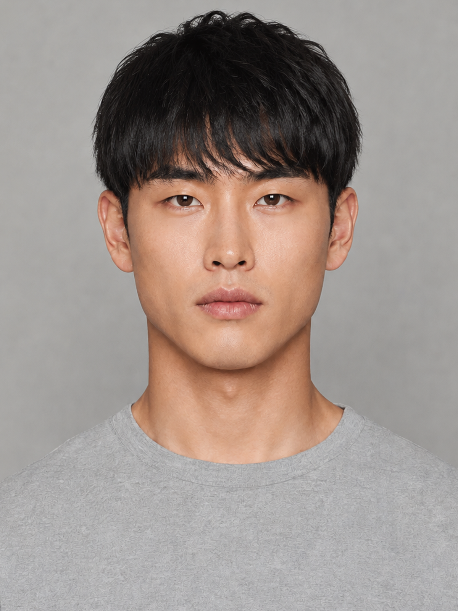
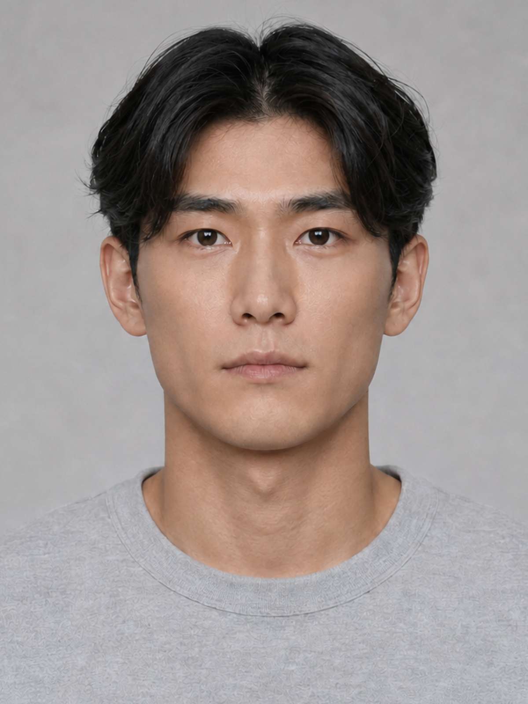
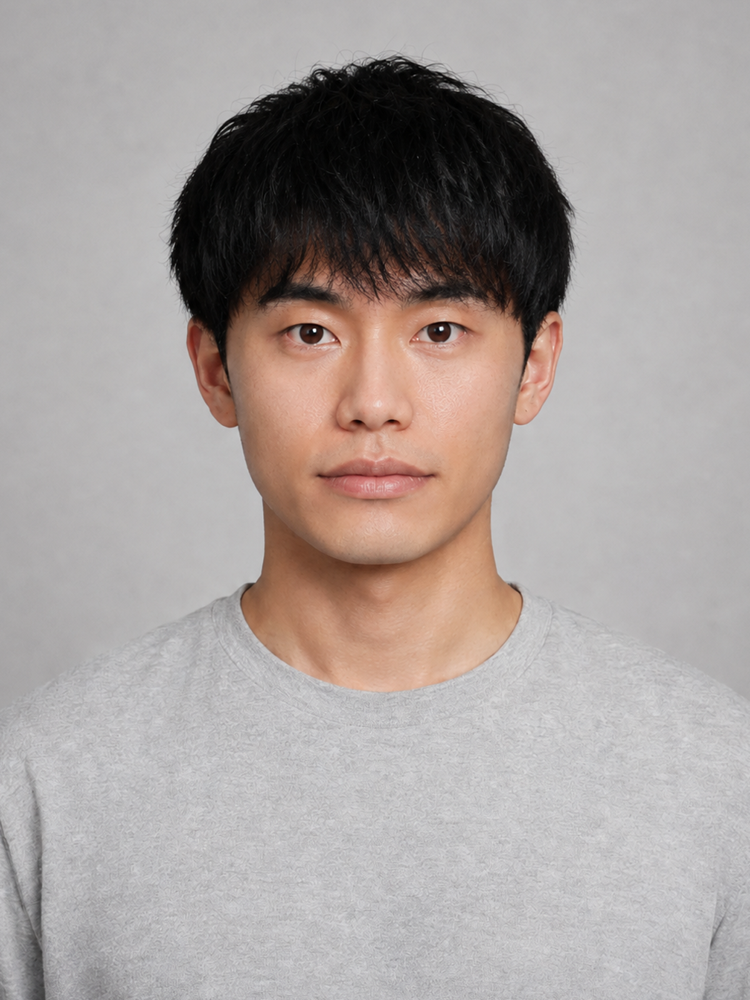
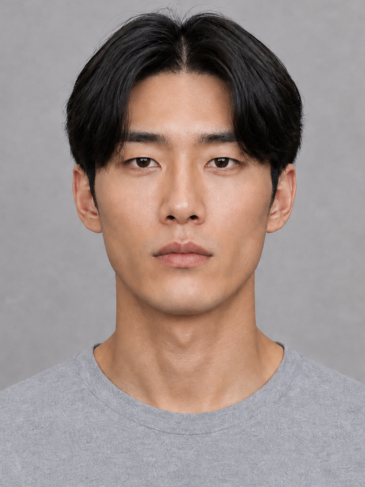
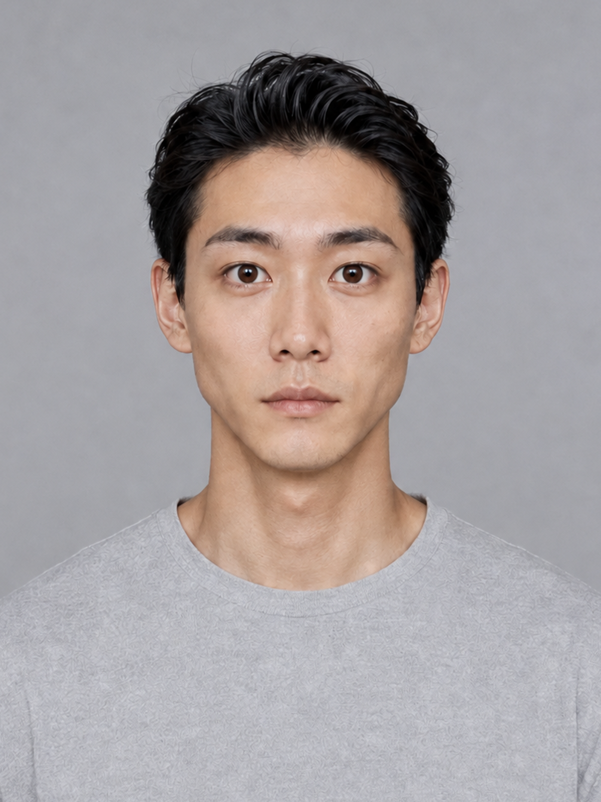
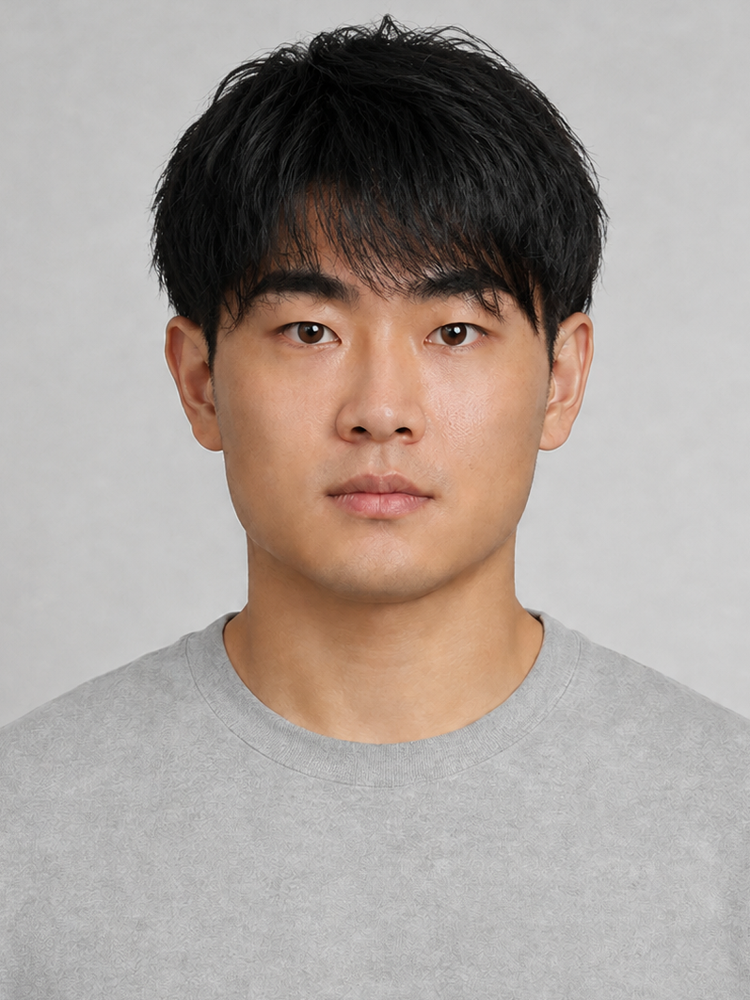
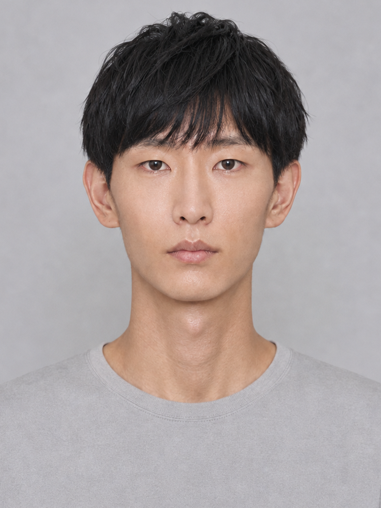
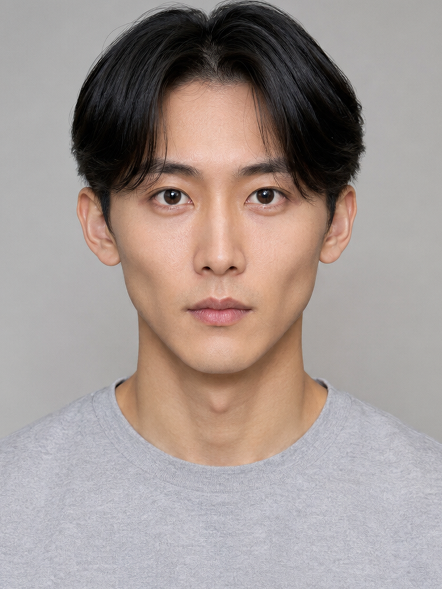
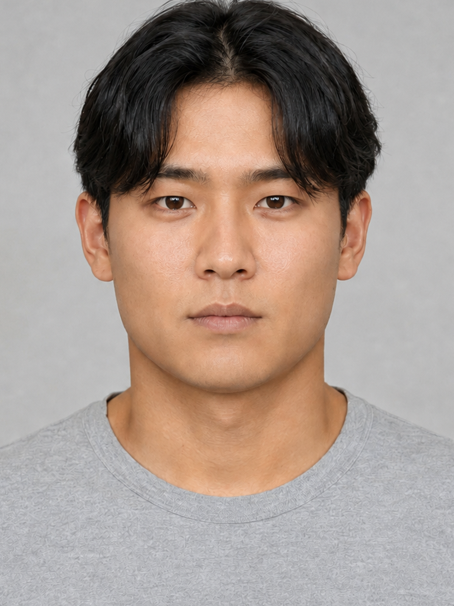

# 男性画像試作 ver3：無作為10人（3.1修正版）

[10枚の確認ページ](男性画像試作_ver3.html) / [改訂設計書](設計書_ver3.md) / [男性40人](画像生成用特徴量_男性40人_ver3.md) / [女性40人](画像生成用特徴量_女性40人_ver3.md)

## 今回の修正

唇の厚さは薄め〜中間、口の横幅は小ぶり〜中間を上限に変更。厚い唇・横に大きい口を生成対象から外した。旧「マッシュ」は、眉にかかる自然な下ろし前髪という意味に修正した。丸いお椀型、重いぱっつん、オン眉を指定しない。女性にも同じ口元の上限と前髪の定義を適用し、肩丈の髪＋自然な下ろし前髪とする。

男性の試作8枚を内蔵imagegenで元画像から編集した。`male_003` と `male_038` は変更対象の特徴に該当せず、画像を保持した。抽出した10人のIDは全員維持している。女性は40人の特徴量・プロンプトを更新済みで、画像生成はまだ行っていない。

## 抽出と履歴

- 初回の抽出seed：`9103096050353372007`。男性40人のID昇順に `random.Random(seed).sample(..., 10)` を適用。
- 抽出順：male_028, male_032, male_016, male_035, male_029, male_012, male_038, male_033, male_003, male_026。
- 初回抽出時の計画SHA-256：`e51b60c3442e9d5b03337b2e4303cd437496e3e14f2bf7f9913f90aec5f00215`。
- 3.1修正後の計画SHA-256：`f3e42073f96e1f524bf9cb274b981529b1592564910d259601a5c205111fcf47`。
- [抽出記録](../data/previews/male_v3_selection.json) / [画像・特徴量・最終プロンプト](../data/previews/male_faces_v3.js)。
- 初回12回の生成（採用10枚）に加え、今回8回の編集。編集前のプロンプト・画像ハッシュ・特徴量は各レコードの `revision_history` に保存。`prompt` は実際の最終指示、`plan_prompt` は修正後の新規生成用プロンプト。

髪型はセンターパート5人・自然な下ろし前髪4人・アップバング1人。輪郭は長方形3・菱形2・ベース型2・短い卵型1・面長卵型1・逆三角型1。引き直しは行っていない。

## 確認

全10枚が1200×1600。更新画像は既存normalizerで顔中心へ揃え、顔検出成功・画像外の余白補完なしを確認。画像パス・ID・SHA-256の対応を検証した。形態値とtagsは生成目標で、実測値ではない。前髪で隠れた眉の特徴は未確認として記録する。

## 画像一覧

| ID | 画像 | 修正後の生成目標 | 目視メモ |
| --- | --- | --- | --- |
| male_028 |  | 長方形・アーモンド・つり・唇中間／中間・自然な下ろし前髪 | 下ろし前髪を眉にかかる長さへ変更し、丸いシルエットを抑えた。唇の厚みを控えめに調整。前髪で眉が一部隠れるため眉形態は未確認。 |
| male_032 |  | 長方形・細アーモンド・ややつり・唇中間／薄い・センターパート | センターパートを保ち、口幅を中間以内・唇を薄めに調整。 |
| male_016 |  | 短い卵型・丸アーモンド・ややつり・唇中間／中間・自然な下ろし前髪 | 眉にかかる自然な下ろし前髪へ変更。横に大きかった口と唇の厚みを抑えた。前髪で隠れた眉形態は未確認。 |
| male_035 |  | 長方形・切れ長・やや垂れ・唇やや短い／中間・センターパート | 切れ長の目と輪郭を保ちながら、厚かった上下の唇を中間程度に調整。 |
| male_029 |  | 菱形・丸い・垂れ・唇中間／薄い・アップバング | 額出しと丸い目を保ち、口幅と唇を控えめに調整。 |
| male_012 |  | ベース型・丸アーモンド・やや垂れ・唇短い／中間・自然な下ろし前髪 | 丸いお椀型と眉上の前髪を、眉にかかる自然な下ろし前髪へ変更。前髪で隠れた眉形態は未確認。 |
| male_038 |  | 逆三角型・丸い・ややつり・唇やや短い／薄い・センターパート | 逆三角形の輪郭、丸い目、細い口元の組合せ。目尻の上昇は穏やか。 |
| male_033 |  | 面長卵型・切れ長・ややつり・唇短い／中間・自然な下ろし前髪 | 面長と細い目を保ち、前髪を眉にかかる自然な長さに変更。前髪で隠れた眉形態は未確認。 |
| male_003 |  | 菱形・丸い・やや垂れ・唇短い／やや薄い・センターパート | 頬骨の幅と細い顎、丸い目と小ぶりな口の組合せ。センターパートの毛先が眉尻付近に重なる。 |
| male_026 |  | ベース型・アーモンド・水平・唇短い／中間・センターパート | 幅のある下顎とセンターパートを保ち、唇の厚みを中間程度に抑えた。 |
